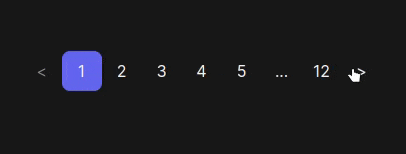
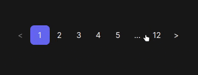

<h1>React Unstyled Pagination</h1>

#   

<p>Unstyled Pagination Component for ReactJS. Built using hooks. Fully typed and accessible</p>

## Demo and examples:

### <p align='center'>[Codesandbox](https://codesandbox.io/p/sandbox/react-unstyled-pagination-example-vmwmt6) &nbsp; &nbsp;|&nbsp; &nbsp; [Storybook](https://react-unstyled-pagination-storybook.vercel.app/)</p>

<p align="center">
    
</p>

<p align="center">
    
</p>

## Install

```bash
npm i react-unstyled-pagination
```

## Parts and Styling

Each part of Pagination Component has a specific data-attribute that can be used for styling

### PaginationPrev

`data-ui`: "prev"
</br>

`data-disabled`: "true" | "false"

### PaginationNext

`data-ui`: "next"
</br>

`data-disabled`: "true" | "false"

### PaginationItem `inside PaginationList component`

`data-ui`: "dot" | "page"
</br>

`data-active`: "true" | "false"

## Example

### Vanilla CSS

```tsx
const [page, setPage] = useState(1);

return (
  <Pagination page={page} onPageChange={setPage} className='pagination'>
    <PaginationPrev className='pagination-next pagination-item'>
      {`<`}
    </PaginationPrev>
    <PaginationList className='pagination-item' truncateText='...' />
    <PaginationNext className='pagination-prev pagination-item'>
      {`>`}
    </PaginationNext>
  </Pagination>
);
```

```css
:root {
  --clr-primary: #6366f1;
  --clr-primary-dark: #4338ca;
  --clr-primary-light: #a5b4fc;
  --clr-neutral: #64748b;
  --clr-neutral-dark: #334155;
  --clr-neutral-light: #cbd5e1;
}

.pagination {
  display: flex;
  list-style-type: none;
}
.pagination > * + * {
  margin-left: 16px;
}

.pagination-item {
  font-size: 20px;
  border-radius: 16px;
  background-color: var(--clr-neutral-light);
  color: var(--clr-neutral-dark);
  width: 48px;
  height: 48px;
  display: inline-flex;
  justify-content: center;
  align-items: center;
  font-weight: 500;
  cursor: pointer;
}
.pagination-item:hover {
  background-color: var(--clr-neutral);
}

[data-disabled='true'],
[data-ui='dot'] {
  opacity: 0.5;
  cursor: not-allowed;
}

[data-active='true'] {
  background-color: var(--clr-primary);
  color: white;
}
[data-active='true']:hover {
  background-color: var(--clr-primary-dark);
}
```

### Use With TailwindCSS

```tsx
const [page, setPage] = useState(1);

return (
  <Pagination
    page={page}
    onPageChange={setPage}
    total={12}
    boundaries={1}
    siblings={1}
    className='mx-auto flex items-center justify-center'
  >
    <PaginationPrev className='w-[40px] h-[40px] data-[disabled=true]:opacity-50 data-[disabled=true]:cursor-not-allowed'>{`<`}</PaginationPrev>
    <PaginationList className='w-[40px] h-[40px] relative rounded-lg data-[active=true]:bg-indigo-500 transition-all' />
    <PaginationNext className='w-[40px] h-[40px] data-[disabled=true]:opacity-50 data-[disabled=true]:cursor-not-allowed'>{`>`}</PaginationNext>
  </Pagination>
);
```

### Use With NextJS Link

```tsx
'use client';

import {
  Pagination,
  PaginationList,
  PaginationNext,
  PaginationPrev,
  getTotalPages,
} from 'react-unstyled-pagination';
import Link from 'next/link';
import { usePathname } from 'next/navigation';

const PaginationWithNextLink = (props) => {
  const { page, totalItem, itemPerPage } = props;
  const pathname = usePathname();
  const totalPages = getTotalPages(totalItem, itemPerPage);

  return (
    <Pagination
      page={page}
      total={totalPages}
      paginationA11yOptions={{
        dotsMessage: 'see more...',
        nextMessage: 'to next page',
        prevMessage: 'to previous page',
        pageMessage: 'to page',
      }}
      className='flex list-style-none flex-wrap space-x-3 text-neutral-500'
    >
      <PaginationPrev asChild>
        <Link
          href={pathname + '?page=' + (page - 1)}
          className='w-[40px] h-[40px] inline-flex justify-center items-center bg-neutral-100 rounded-lg data-[disabled=true]:opacity-50 data-[disabled=true]:pointer-events-none'
        >
          {`<`}
        </Link>
      </PaginationPrev>

      <PaginationList
        renderItem={(item) => (
          <Link
            href={pathname + '?page=' + item.value}
            className='cursor-pointer w-[40px] h-[40px] inline-flex justify-center items-center rounded-lg bg-neutral-100 data-[active=true]:bg-indigo-500 data-[active=true]:hover:bg-indigo-600 data-[active=true]:text-indigo-50 transition-all data-[ui=dot]:pointer-events-none outline-none focus-visible:ring-4 focus-visible:ring-indigo-300 hover:bg-neutral-200'
          >
            {item.value}
          </Link>
        )}
      />

      <PaginationNext asChild>
        <Link
          href={pathname + '?page=' + (page + 1)}
          className='w-[40px] h-[40px] bg-neutral-100 rounded-lg data-[disabled=true]:opacity-50 data-[disabled=true]:pointer-events-none inline-flex justify-center items-center'
        >
          {`>`}
        </Link>
      </PaginationNext>
    </Pagination>
  );
};
```

### With Nextjs Router

```tsx
'use client';

import { usePathname, useRouter } from 'next/navigation';
import {
  Pagination,
  PaginationList,
  PaginationNext,
  PaginationPrev,
  getTotalPages,
} from 'react-unstyled-pagination';
import { useCallback } from 'react';

const PaginationWithRouter = (props) => {
  const { page, totalItem, itemPerPage } = props;
  const pathname = usePathname();
  const router = useRouter();
  const totalPages = getTotalPages(totalItem, itemPerPage);

  const handleNavigate = useCallback(
    (page) => {
      router.push(pathname + '?page=' + page);
    },
    [router, pathname]
  );

  return (
    <Pagination
      page={page}
      total={totalPages}
      onPageChange={handleNavigate}
      className='flex list-style-none flex-wrap space-x-3 text-neutral-500'
    >
      <PaginationPrev className='w-[40px] h-[40px] bg-neutral-100 rounded-lg data-[disabled=true]:opacity-50 data-[disabled=true]:pointer-events-none'>
        {`<`}
      </PaginationPrev>

      <PaginationList className='cursor-pointer w-[40px] h-[40px] rounded-lg bg-neutral-100 data-[active=true]:bg-indigo-500 data-[active=true]:hover:bg-indigo-600 data-[active=true]:text-indigo-50 transition-all data-[ui=dot]:pointer-events-none outline-none focus-visible:ring-4 focus-visible:ring-indigo-300 hover:bg-neutral-200' />

      <PaginationNext className='w-[40px] h-[40px] bg-neutral-100 rounded-lg data-[disabled=true]:opacity-50 data-[disabled=true]:pointer-events-none'>
        {`>`}
      </PaginationNext>
    </Pagination>
  );
};
```

### usePagination

For advanced customization use cases, a hook usePagination() hook is exposed. It accepts almost the same options as the Pagination component.

```tsx
const totalPages = 12;
const [page, setPage] = useState(1);

const { activePage, range } = usePagination({
  page,
  total: totalPages,
  boundaries: 1,
  siblings: 1,
});
```

```tsx
<ul>
  {range.map((value, index) => {
    if (value === 'dots') return <li key={index}>...</li>;
    return (
      <li
        key={index}
        onClick={() => setPage(value)}
        style={{
          backgroundColor: activePage === value ? 'red' : 'transparent',
        }}
      >
        {value}
      </li>
    );
  })}
</ul>
```

## API Reference

### PaginationProps

<!-- `page` : Number -->
 <!-- **Required** Current page, start from 1 (can be controlled) -->

| Parameters              | Type                     | Description                                                               |
| :---------------------- | :----------------------- | :------------------------------------------------------------------------ |
| `page`                  | `number`                 | **Required** Current page, start from 1 (can be controlled)               |
| `total`                 | `number`                 | **Required**. Total pages of pagination unmounts                          |
| `boundaries`            | `number`                 | **Default: 1** Number of visible pages at the start and end of pagination |
| `siblings`              | `number`                 | **Default: 1** Number of visible pages before and after the current page. |
| `onPageChange`          | `(page: number) => void` | Callback fired when page is changed.                                      |
| `paginationA11yOptions` | `PaginationA11yOptions`  | Options to change pagination items aria-label.                            |

</br>

### PaginationA11Options

| Parameters    | Type     | Description                                                  |
| :------------ | :------- | :----------------------------------------------------------- |
| `dotsMessage` | `string` | **Default: see more...** Aria-label for dots message         |
| `prevMessage` | `string` | **Default: to previous page** Aria label for previous button |
| `nextMessage` | `string` | **Default: to next page** Aria label for next button.        |
| `pageMessage` | `string` | **Default: page** Aria label for pagination item             |

</br>

### PaginationPrevProps & PaginationNextProps

| Parameters             | Type      | Description                                                                                                            |
| :--------------------- | :-------- | :--------------------------------------------------------------------------------------------------------------------- |
| `asChild`              | `boolean` | **Default: false** Compose functionality onto alternative element types or your own React components. (@radix-ui/slot) |
| `addDisabledAttribute` | `boolean` | **Default: false** Add disabled attribute to component (useful when component is `<button></button>`)                  |

</br>

### PaginationListProps

| Parameters     | Type                                  | Description                                                |
| :------------- | :------------------------------------ | :--------------------------------------------------------- |
| `truncateText` | `string`                              | **Default: ...** Display text of dot element (default ...) |
| `renderItem`   | `(item: PaginationItem) => ReactNode` | The pagination item render function.                       |

```tsx
PaginationItemType = 'dots' | 'next' | 'prev';

PaginationItemValue = number | PaginationItemType;

PaginationItem: {
  value: PaginationItemValue;
  isActive: boolean;
  ariaLabel: string | undefined;
}
```

## License

MIT

## Author

[Tuan Vu](https://github.com/turn25)
